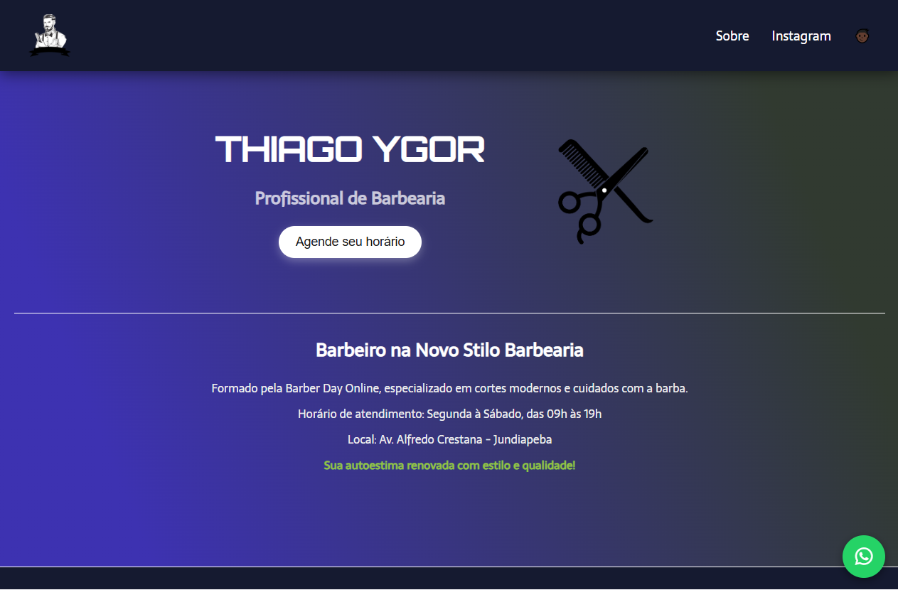

💈 Barbearia Thiago 💈

Barbearia Thiago é uma landing page moderna e responsiva para divulgação dos serviços de uma barbearia. O design é pensado para atrair clientes oferecendo uma experiência simples, elegante e fácil de navegar, seja no desktop ou no mobile.

🚀 Funcionalidades 🚀

1. Layout 100% responsivo para todos os dispositivos
2. Seção de serviços oferecidos com descrição e imagens
3. Formulário de contato simples e direto
4. Informações de localização e horário de atendimento
5. Links para redes sociais para fácil comunicação

🛠️ Tecnologias Utilizadas 🛠️

•HTML
•CSS
•JavaScript
•Netlify (para deploy)

🌐 Deploy 🌐

Acesse a landing page online em:
👉 https://barbeariathiago.netlify.app/

📦 Como usar localmente 📦

Clone o repositório:

git clone https://github.com/unkdep/BarbeariaThiago.git
Abra o arquivo index.html no navegador.

Observação: Projeto estático, não requer servidor local.

📄 Licença 📄

Este projeto está sob a licença MIT. Consulte o arquivo LICENSE para mais detalhes.

